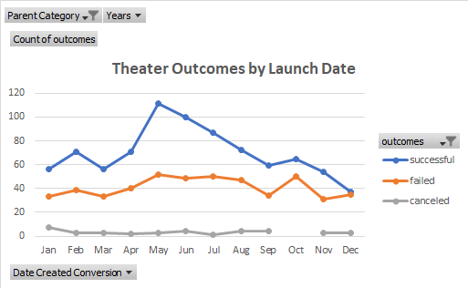
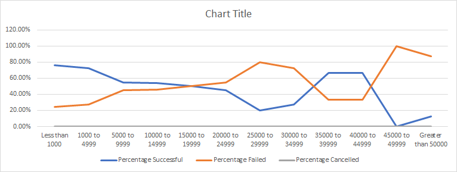

# Kickstarting with Microsoft Excel
Performing analysis on "Kickstarter" dataset to uncover trends.

## The Overview
We needed to help a person named Louise, who was interested in comparing her fundraising campaign to that of other people. Then we were given a data set, and are now tasked to  find under what conditions the fundraising goals were most likely to be met. One aspect I explored was figuring out what months were most ideal to try and fundraise in. Another premise that I was looking into was the outcome of fundraising based on the goal they initially set. To perform these calculations, the use of pivot tables and pivot graphs were necessary to solve this case.

### Purpose
The overall purpose of this assignment was to determine and predict how Louise's play "Fever" compared in its fundraising goal in respect to different campaigns in relation to their launch dates and funding goals. To determine the overall results, creating pivot charts and tables were the key parts on understanding it all.

## The Analysis and Challenges
The biggest challenge I had during this assignment was trying to determine what varaibles that I have typed wrong on Deliverbale 2 and it took me quite a while to figure it out, experimenting on what I did wrong and I have finally came to a conclusion that I have essentially selected a wrong column in the Kickstarter sheet, instead of column D I have picked column E and I needed to change the codes for the three columns in order to fix it. Eventually I was able to fix it. Another point was to understand on how target amount and month of fundraising impacted on how successful the campaign would be, I had to use pivot tables. Pivot tables were the essentials to this challenge, because they allowed me to pull and altar certain types of data and create efficient charts.

### The Analysis of Outcomes Based on Launch Date
Given our data set, I created a pivot table to inspect when various fundraising campaigns kicked off. When I graphed the results and found the percentage of success for the various months, the results seemed fairly clearly. Based off my findings, the warmer months such as "May", "June", and "July" statistically had a much higher chance to reach their goal than in the colder months like "November", "December" and "January". This leads me to believe that during the summer, people tend to give more. Perhaps during the winter time, people are strapped with little cash because of christmas gifts they have to purchase.

### The Analysis of Outcomes Based on Goals
Using a line chart, I could see that in general, the higher the goal was set, the more likely the campaign was to fail. However, there was an anomally in the data which segmented this trend between a target of around $30,000 to $40,000 where somehow people managed to hit their goal more often, than the data immediately surrounding them. Those with a fundraising goal of less than $5,000 hit their goal around 70% of the time or more. However, those who set a goal to fundraise for $45,000 or more had over an 80% chance to not hit their goal. In general, the higher the fundraising target was set the more likely the campaign would fail to reach their number.

### The Challenges and Difficulties Encountered
Navigating the pivot tables seemed to be a tough interacction for me at first. I was constantly second guessing which variables I wanted to put in or exclude. In addition, several of the formulas, especially the outcomes based on goals with the restrictions added took me a while to fully account for.

## Results / Conclusion
Q#1 What are two conclusions you can draw about the Outcomes based on Launch Date?
1) Time of year really does impact the success of a campaign. According to our data, the months of "May" and "June" have the highest chance of meeting their fundraising goal, while months like November, December, and January (the colder months in America and Europe) all have a much lower chance of meeting their goal.
2) The summer months, like May, June, and July all seem to have higher chances for success rates on meeting their funraising goal. One thing I do notice in the dataset, is that the number of data points during these months is much higher too (more events go on during these months). I wonder if the lack of data outside of the summer months can skew the data slightly.

- What can you conclude about the Outcomes based on Goals?
I can conclude companies that shoot for over $45,000 in fundraising or more statistically have a much lower chance of meeting their goal than those with goals of less than amount.
